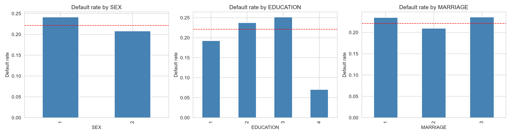
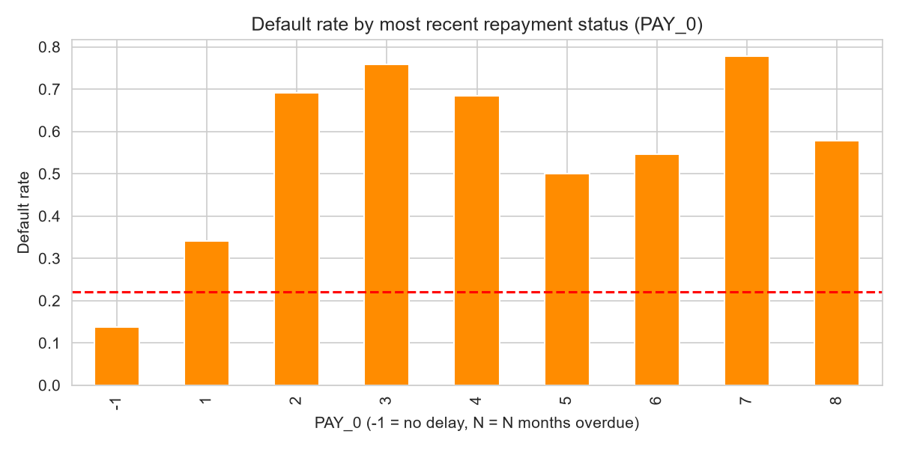
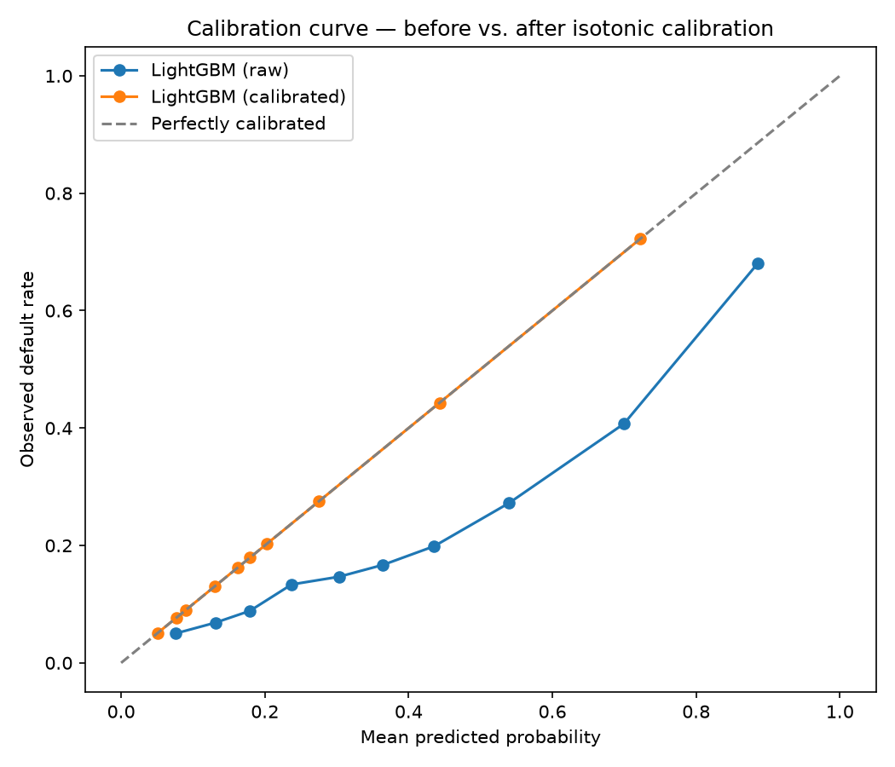
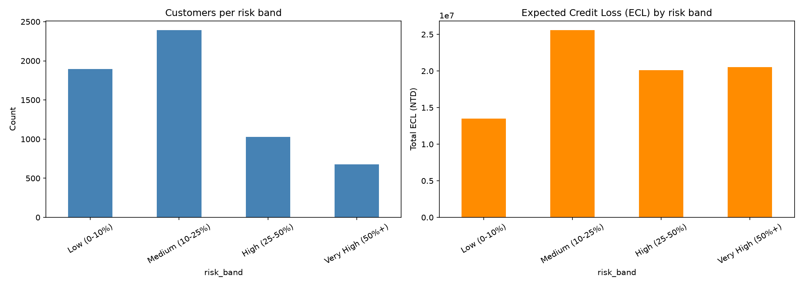
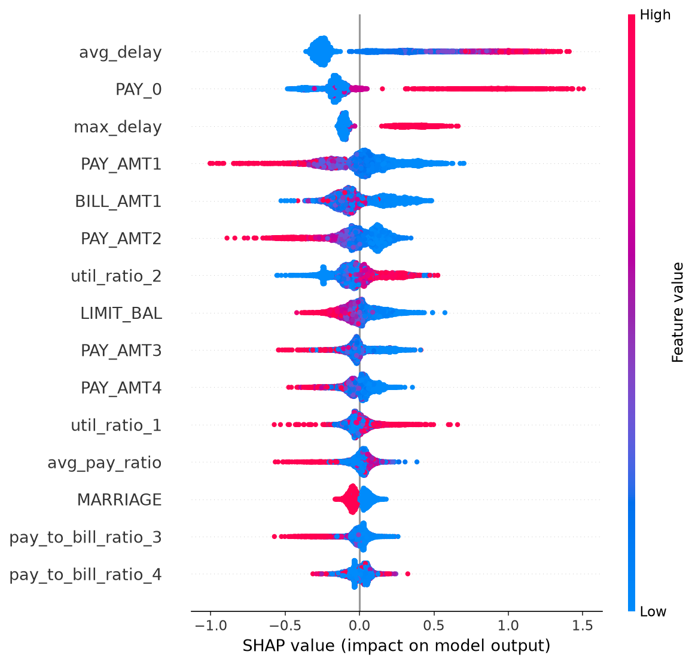
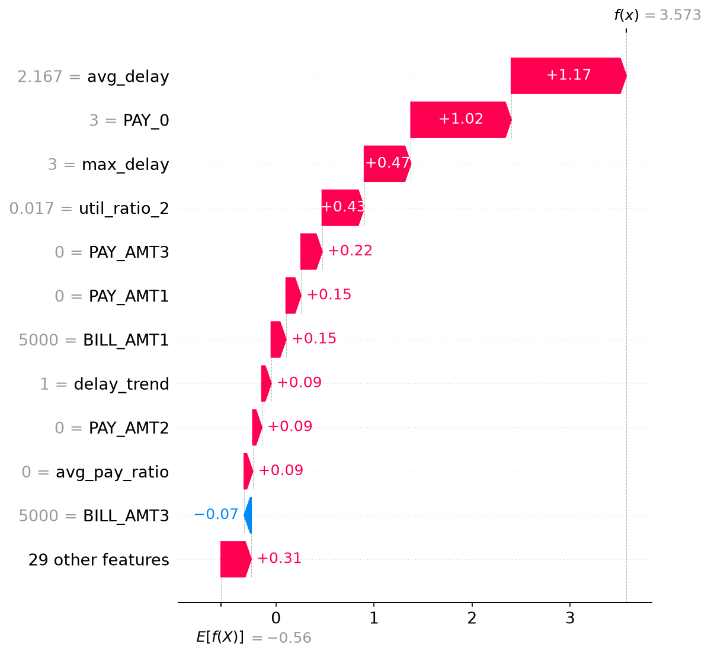
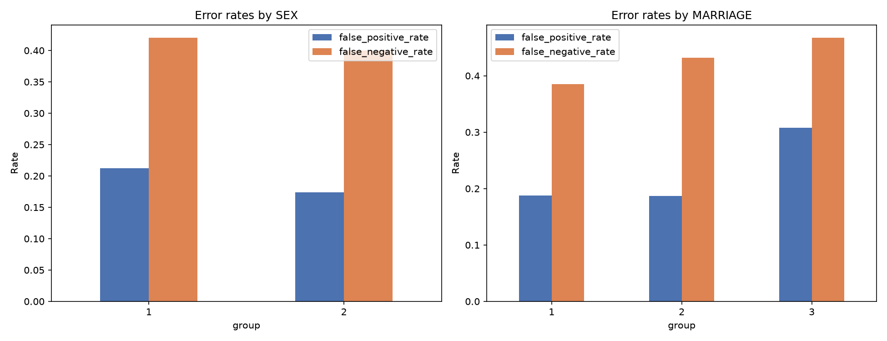

# Credit Default Risk & Expected Credit Loss Modelling for a Retail Card Portfolio

**A calibrated probability-of-default model with SHAP explainability, cost-based
decision thresholds, and an illustrative Expected Credit Loss (ECL) calculation
aligned with NFRS-style risk frameworks.**

---

## Executive Summary

Banks lose money in two ways when assessing credit risk: by lending to customers
who default, and by rejecting good customers out of excessive caution. This project
builds a probability-of-default (PD) model on 30,000 real credit card accounts,
**calibrates it so its predicted probabilities match real-world outcomes** (not just
ranking customers correctly), and uses those calibrated probabilities to estimate
portfolio-level Expected Credit Loss — the same PD × LGD × EAD framework used in
IFRS 9 / NFRS-aligned banking risk management.

**Key results:**
- LightGBM classifier: **0.78 ROC-AUC** (5-fold cross-validated, std 0.005)
- After isotonic calibration, predicted default rates match actual default rates to
  **within thousandths across every risk band** — the model's probabilities are not
  just a ranking score, they are believable real-world estimates
- Portfolio-level expected credit loss: **7.91% of total exposure**, with the
  highest-risk 11% of customers responsible for a disproportionate share of that loss
- A fairness audit found a real, moderate disparity in false-positive rates by sex
  (21.2% for male customers vs. 17.4% for female customers), which is documented
  rather than hidden

## Business Problem

Retail lenders need to estimate, for every customer, the probability that they will
default on their credit obligations — and translate that probability into a concrete
expected financial loss. This underpins three real decisions banks make constantly:

1. **Underwriting** — should this customer be approved, and at what credit limit?
2. **Risk-based pricing** — should higher-risk customers be charged a higher interest
   rate to compensate for expected losses?
3. **Capital provisioning** — how much money must the bank set aside today to cover
   losses it expects to realize in the future (the ECL requirement under IFRS 9 /
   NFRS 9 accounting standards)?

Getting PD (Probability of Default) wrong in either direction is costly: underestimate
it, and the bank under-provisions and gets caught exposed when defaults hit; overestimate
it, and the bank over-provisions, ties up capital unnecessarily, and may reject
creditworthy customers.

This project builds and evaluates a PD model, explicitly checks whether its predicted
probabilities can be trusted at face value (calibration — often skipped in portfolio
projects but critical in practice), and uses those probabilities to compute an
illustrative portfolio-level ECL.

---

## Dataset

**Source:** [UCI Machine Learning Repository — Default of Credit Card Clients](https://archive.ics.uci.edu/dataset/350/default+of+credit+card+clients)
**Citation:** Yeh, I. (2009). *Default of Credit Card Clients* [Dataset]. UCI Machine
Learning Repository. https://doi.org/10.24432/C55S3H
**Original paper:** Yeh, I. C., & Lien, C. H. (2009). The comparisons of data mining
techniques for the predictive accuracy of probability of default of credit card
clients. *Expert Systems with Applications*, 36(2), 2473–2480.
**License:** CC BY 4.0

**Why this dataset:** it is a peer-reviewed, DOI-registered, widely-cited real-world
dataset (30,000 actual credit card accounts in Taiwan, 2005), not a synthetic or
undocumented Kaggle upload. Several candidate datasets were evaluated for this
project and rejected for weaker provenance — see [Dataset Selection](#dataset-selection-process)
below.

**Contents:** 30,000 credit card clients, 23 raw features:
- Demographics: credit limit, sex, education, marital status, age
- 6 months of repayment status (April–September 2005)
- 6 months of bill statement amounts
- 6 months of prior payment amounts
- Target: default payment next month (binary)

**Real-world context:** in the early-to-mid 2000s, Taiwanese banks over-issued credit
cards to unqualified applicants to grow market share. Combined with cardholders
overusing revolving credit, this produced a documented consumer debt crisis — the
same dynamic that makes accurate PD estimation matter in any credit market,
including Nepal's growing retail banking sector today.

### Dataset Selection Process

Several public datasets were evaluated before choosing this one:

| Dataset | Verdict | Reason |
|---|---|---|
| Kaggle `insurance_claims.csv` (fraud) | Rejected | No traceable original collector; third-party Mendeley upload with unclear provenance; only 1,000 rows |
| IBM Telco Customer Churn | Rejected | Explicitly documented by IBM as a **fictional** company's sample data |
| ULB Credit Card Fraud (Kaggle) | Rejected | Real, but features are anonymized PCA components (V1–V28) — makes feature engineering and explainability essentially meaningless |
| Home Credit Default Risk (Kaggle) | Rejected | Real and high-quality, but 7 relational tables — too large in scope for the available timeline |
| **UCI Default of Credit Card Clients** | **Selected** | Real, peer-reviewed, DOI-registered, CC BY 4.0, single clean table, directly maps to a bank credit-risk use case |

---

## Methodology

The project follows a standard, reproducible data science pipeline. Each stage is
implemented as a separate, numbered Jupyter notebook, backed by reusable code in `src/`.

| Stage | Notebook | What it does |
|---|---|---|
| 1. Data loading & validation | `01_data_verification.ipynb` | Downloads data from UCI, checks shape, missing values, duplicates, class balance |
| 2. Cleaning | `01_data_verification.ipynb` | Deduplicates, recodes undocumented category values (see Data Cleaning Decisions) |
| 3. EDA & statistics | `02_eda.ipynb` | Distribution analysis, chi-square and Mann-Whitney U tests against the target |
| 4. Feature engineering | `03_feature_engineering.ipynb` | Derives repayment-delay, utilization, and payment-ratio features |
| 5. Modelling | `04_modelling.ipynb` | Trains logistic regression (interpretable baseline) and LightGBM |
| 6. Evaluation | `05_evaluation.ipynb` | ROC-AUC, precision/recall, calibration curves, isotonic recalibration, cost-based threshold selection, 5-fold cross-validation |
| 7. ECL calculation | `05_evaluation.ipynb` | Portfolio-level Expected Credit Loss using calibrated PD × assumed LGD × EAD |
| 8. Explainability | `06_explainability.ipynb` | SHAP global feature importance and individual prediction breakdown |
| 9. Fairness audit | `07_fairness_audit.ipynb` | Per-group error rate comparison across SEX and MARRIAGE |

**Reproducibility:** all randomness is seeded (`random_state=42`); raw data is
never committed — it is downloaded fresh via the UCI API on first run
(`src/data.py`), so results are independently reproducible from a clean clone.

### Data Cleaning Decisions

| Issue found | Decision | Rationale |
|---|---|---|
| 35 exact duplicate rows | Dropped | Likely data-entry duplication; no way to distinguish real repeat customers from copy errors |
| `EDUCATION` codes 0, 5, 6 (undocumented; docs only define 1–4) | Folded into code 4 ("others") | Conservative — avoids inventing meaning for undocumented codes while preserving the rows |
| `MARRIAGE` code 0 (undocumented; docs only define 1–3) | Folded into code 3 ("others") | Same rationale as above |
| `PAY_x` codes −2 and 0 (undocumented; docs only define −1 and 1–9) | Collapsed into −1 ("no delay") | Common interpretation in the literature on this dataset: both represent "no overdue balance," just via different credit-usage patterns |
| 1 new duplicate created *after* recoding | Dropped in a second pass | Recoding can make two previously-distinct rows identical; caught by re-running deduplication after recoding, not just before |

---

## Exploratory Data Analysis — Key Findings

- **Baseline default rate:** 22.1% (29,964 clients after cleaning).
- **Most recent repayment status (`PAY_0`) is the strongest univariate predictor**
  (χ² = 5324.9, p < 1e-300 — numerically indistinguishable from zero). Default rate
  rises sharply and near-monotonically as recent repayment delay increases.
- **Credit limit (`LIMIT_BAL`) is strongly associated with default** (Mann-Whitney U,
  p = 6.4×10⁻¹⁹⁰). Median limit for defaulters (NT$90,000) is 40% lower than for
  non-defaulters (NT$150,000) — consistent with banks extending larger limits to
  customers they already assessed as lower-risk.
- **Age is not a significant predictor** (p = 0.40; median age 34 in both groups).
  A genuine negative finding, not an oversight.
- **SEX, EDUCATION, and MARRIAGE all show statistically significant association**
  with default (p < 0.001 for all three, chi-square test), though each more weakly
  than repayment history or credit limit. SEX and MARRIAGE are treated as protected
  attributes and examined further in the Fairness Audit section below, rather than
  used to justify differential treatment.




---

## Feature Engineering

Beyond the 23 raw columns, the following features were derived from the 6-month
repayment history to give the model (and a human reviewer) more signal than any
single month alone:

| Feature | Definition | Correlation with default |
|---|---|---|
| `avg_delay` | Mean of the 6 monthly repayment-status codes | **0.387** |
| `max_delay` | Worst (highest) delay across the 6 months | 0.374 |
| `delay_trend` | `PAY_0 − PAY_6` — is repayment behavior worsening or improving? | 0.170 |
| `avg_util_ratio` | Mean of (bill amount ÷ credit limit) across 6 months | 0.115 |
| `avg_pay_ratio` | Mean of (amount paid ÷ bill amount) across 6 months | −0.120 |

All correlations are in the expected direction (higher delay/utilization → higher
risk; higher payment ratio → lower risk), and none of the engineered features
outrank raw repayment history — a realistic, honest result rather than an inflated
claim that feature engineering was the primary driver of model performance.

**Notably**, once combined with all other features inside the trained model, SHAP
analysis (see Explainability section) found `avg_delay` — not `PAY_0` — to be the
single most important feature overall, showing that 6-month repayment consistency
carries more information than any one month in isolation.

---

## Model Comparison

Two models were trained and compared: **logistic regression** as an interpretable
baseline (the same modelling family real banks use for regulatory-facing PD models,
since every coefficient has a clear interpretation), and **LightGBM** as a stronger,
non-linear alternative.

| Model | ROC-AUC (test) | Recall (default) | Precision (default) |
|---|---|---|---|
| Logistic Regression | 0.754 | 0.598 | 0.454 |
| LightGBM | 0.772 | 0.591 | 0.471 |
| **LightGBM (5-fold CV)** | **0.781 ± 0.005** | — | — |

**Both models used `class_weight="balanced"`**, since the dataset is imbalanced
(~22% positive class); without this, a model can achieve high accuracy by simply
predicting "no default" for almost everyone while catching very few actual
defaulters. Accuracy alone is therefore not reported as a primary metric — with
this class balance, a trivial "always predict no default" model would already
score ~78% accuracy while catching zero defaulters.

**LightGBM outperforms logistic regression, but only modestly (~1.8 AUC points).**
This suggests most of the predictive signal in this dataset is close to linear —
recent repayment behavior and credit utilization drive risk in a fairly monotonic
way — and a well-specified logistic regression captures most of it. LightGBM's gain
comes from precision, not from catching more defaulters (recall is nearly
identical between the two models).

**5-fold cross-validation** (mean AUC 0.781, std 0.005) confirms the single
train/test split result (0.772) was not a lucky or unlucky draw — performance is
stable across different data partitions.

---

## Calibration

A model can rank customers correctly (good AUC) while still producing probability
estimates that don't match real-world frequencies — e.g. predicting "35% risk" for
a group that actually defaults 50% of the time. This matters enormously for ECL,
where PD must be a believable probability, not just a ranking score — a concern
raised in the dataset's own original paper (Yeh & Lien, 2009).

**Finding:** the raw LightGBM model was meaningfully miscalibrated — it
systematically **overestimated** default risk across most of the probability
range. At a predicted probability of ~0.40, the true observed default rate was
only ~0.20 — roughly 2× too pessimistic.

**Fix:** isotonic regression calibration (`CalibratedClassifierCV`) was applied.
ROC-AUC was essentially unchanged (0.772 → 0.775), which is expected — calibration
is a monotonic transformation, so it doesn't change how the model *ranks*
customers, only how well its probabilities match reality.



*Note: calibration was fit and evaluated on the same held-out test set in this
project, a known simplification given the timeline. A production pipeline would
use a separate calibration holdout distinct from the final evaluation set.*

---

## Cost-Based Decision Threshold

The default 0.5 classification threshold is arbitrary. In credit risk, missing a
real defaulter (false negative) is typically far more costly to a lender than
flagging a safe customer for extra review (false positive). Assuming an
illustrative 5:1 cost ratio (missing a default costs 5× a false alarm), the
cost-optimal threshold was found to be **0.17**, not 0.5.

| Threshold | Missed defaulters (FN) | False alarms (FP) | Recall |
|---|---|---|---|
| 0.50 (default) | 868 | 221 | 34.5% |
| **0.17 (cost-optimal)** | **308** | 1,835 | **76.8%** |

At the default threshold, the model looks cautious but silently fails at its core
job — catching only 34.5% of real defaulters. Lowering the threshold trades a
large increase in false alarms for a much larger reduction in missed defaults,
which is the right trade-off under the stated cost assumption.

*The 5:1 cost ratio is illustrative, not derived from real bank loss data — it
demonstrates the method, which is a business decision each institution must make
with its own figures, not a fixed technical fact.*

---

## Expected Credit Loss (ECL)

Using the **calibrated** PD, ECL was computed per customer as:

**ECL = PD × LGD × EAD**

- **PD** — calibrated model output
- **LGD (Loss Given Default)** — assumed at **45%**, a commonly cited
  industry rule-of-thumb for unsecured retail credit (no recovery data exists in
  this dataset to fit LGD empirically)
- **EAD (Exposure at Default)** — approximated using `LIMIT_BAL` as a proxy for
  unsecured card exposure

### Portfolio-Level Result

| Metric | Value |
|---|---|
| Total exposure (EAD) | NT$1,007,510,000 |
| Total expected credit loss (ECL) | NT$79,693,033 |
| **ECL as % of exposure** | **7.91%** |

### Risk Band Breakdown

| Risk band | Customers | Avg. predicted PD | Actual default rate | ECL as % of EAD |
|---|---|---|---|---|
| Low (0–10%) | 1,896 | 0.068 | 0.068 | 2.92% |
| Medium (10–25%) | 2,392 | 0.168 | 0.168 | 7.43% |
| High (25–50%) | 1,026 | 0.330 | 0.330 | 14.92% |
| Very High (50%+) | 677 | 0.675 | 0.675 | 30.74% |

**The predicted PD matches the actual observed default rate to within thousandths
in every single risk band** — the strongest evidence in this project that
calibration succeeded and the model's probabilities are trustworthy, not just
rank-ordered.

**Business insight:** the "Very High" risk band is only **11% of the portfolio**
by customer count, but its ECL (NT$20.5M) is nearly identical to the much larger
"Medium" band's ECL (NT$25.6M, 2,392 customers). Expected losses concentrate
sharply in a small high-risk segment — directly supporting risk-based pricing or
tighter underwriting for that segment.



### ECL Methodology Limitations

- **PD horizon mismatch:** the dataset labels "default in the next month," while
  NFRS 9 / IFRS 9 ECL requires 12-month PD (Stage 1) or lifetime PD (Stage 2/3).
  A production-grade model needs survival-style multi-period PD estimation.
- **LGD is assumed (45%), not fitted** — no recovery/write-off data exists in this
  dataset.
- **EAD uses credit limit as a proxy**, not actual outstanding balance at default.
- **No macroeconomic overlay** — real IFRS 9/NFRS ECL incorporates forward-looking
  macro scenarios (unemployment, GDP); this analysis is static and historical.

Despite these simplifications, the PD component — the hardest part to get right —
is demonstrably well-calibrated, which is the piece most directly transferable to
a real ECL pipeline.

---

## Explainability

SHAP (SHapley Additive exPlanations) with `TreeExplainer` was applied to the
underlying LightGBM model to understand *why* it makes the predictions it does —
not just how accurate those predictions are. This was applied to the base
(uncalibrated) LightGBM model rather than the calibrated wrapper, since isotonic
calibration only rescales output probabilities and does not change which features
drive the underlying decision.

### Global Feature Importance



**Top drivers of predicted default risk**, in order: `avg_delay` (6-month average
repayment delay), `PAY_0` (most recent month's repayment status), `max_delay`
(worst single-month delay). This refines the univariate EDA finding — sustained
repayment behavior over 6 months carries more information than any single month in
isolation, confirming the engineered `avg_delay` feature added genuine predictive
value beyond what raw EDA alone suggested.

### Individual Prediction Example



A waterfall plot for the test-set customer with the highest model-driven risk score
shows exactly which features pushed their prediction toward default and by how
much — the type of case-level explanation a loan officer or regulator could
reasonably request.

---

## Fairness Audit

SEX and MARRIAGE were flagged in EDA as protected attributes with statistically
significant association with the target. This section checks whether the trained
model's *errors* — not just its overall accuracy — differ meaningfully across
those groups, using the raw LightGBM model at the default 0.5 threshold.

### By Sex (1 = male, 2 = female)

| | Male (n=2,339) | Female (n=3,654) |
|---|---|---|
| AUC | 0.752 | 0.784 |
| Recall | 58.0% | 60.0% |
| False positive rate | **21.2%** | **17.4%** |
| False negative rate | 42.0% | 40.0% |

**Finding:** a real, moderate disparity exists. Male customers are notably more
likely to be wrongly flagged as high-risk (a ~4-point higher false positive rate),
and the model performs better on every metric for female customers. This gap is
not extreme, but it is consistent and would warrant investigation (e.g. per-group
threshold adjustment or fairness-constrained training) before any production use.

### By Marital Status (1 = married, 2 = single, 3 = others)

| | Married (n=2,764) | Single (n=3,162) | Others (n=67) |
|---|---|---|---|
| AUC | 0.789 | 0.756 | 0.705 |
| False positive rate | 18.8% | 18.7% | **30.8%** |
| False negative rate | 38.5% | 43.2% | 46.7% |

**Finding:** a smaller, real gap exists between married and single customers. The
"others" category shows the largest disparity, but at n=67 (~1% of the test set),
this estimate is too small to be treated as a confirmed finding rather than noise.



**Conclusion:** this model should not be deployed for real lending decisions
without a dedicated fairness mitigation step. This audit demonstrates the *method*
for detecting disparate impact — not a bias-free model — which is an honest and
appropriately scoped claim for this project.

---

## Overall Limitations

- **Dataset age and geography:** data is from Taiwan, 2005. Consumer credit
  behavior, regulation, and economic conditions differ substantially in Nepal
  today. This model is a methodology demonstration, not a deployable Nepal-market
  risk model.
- **Single-month default label:** as noted in the ECL section, a true NFRS/IFRS 9
  PD model requires 12-month or lifetime default horizons, not next-month default.
- **No macroeconomic context:** the model is static; real ECL frameworks
  incorporate forward-looking economic scenarios.
- **LGD and EAD are assumptions/proxies**, not fitted from actual recovery or
  exposure data, because none exists in this dataset.
- **Fairness gaps identified but not mitigated:** the audit found real disparities
  by sex and marital status; this project stops at detection, not correction.
- **Calibration was validated on the same test set used to fit it** — a known
  shortcut; a production pipeline requires a separate calibration holdout.

## Future Work

- Extend to multi-period (12-month / lifetime) PD estimation for true NFRS 9
  alignment, following the kind of ECL modelling Dlytica's AI360 platform applies
  for Nepali banks
- Apply a fairness mitigation technique (e.g. per-group threshold calibration,
  reweighting, or a fairness-constrained objective) and re-measure the audit
  results in this README
- Replace the LIMIT_BAL exposure proxy with actual outstanding balance data,
  and fit LGD empirically if recovery data becomes available
- Add a macroeconomic overlay (e.g. scenario-weighted PD) for forward-looking ECL
- Package the scoring pipeline as a batch job that could feed a reverse-ETL
  pipeline into a CRM/loan origination system, mirroring how AI360 Studio closes
  the loop from insight to action

---

## How to Reproduce

```bash
git clone https://github.com/Edgezone-commits/credit-risk-pd-ecl.git
cd credit-risk-pd-ecl
python -m venv .venv
.venv\Scripts\Activate.ps1
pip install -r requirements.txt
jupyter notebook
```

Run the notebooks in order (01 → 07). Raw data is downloaded automatically from
UCI on first run (`src/data.py`) — no manual download needed. Random seeds are
fixed throughout (`random_state=42`) for reproducibility.

---

## Project Structure

```
credit-risk-pd-ecl/
├── README.md
├── requirements.txt
├── .gitignore
├── data/
│   ├── raw/               (downloaded automatically, not committed)
│   └── processed/         (cleaned/feature-engineered data, not committed)
├── notebooks/
│   ├── 01_data_verification.ipynb
│   ├── 02_eda.ipynb
│   ├── 03_feature_engineering.ipynb
│   ├── 04_modelling.ipynb
│   ├── 05_evaluation.ipynb
│   ├── 06_explainability.ipynb
│   └── 07_fairness_audit.ipynb
├── src/
│   ├── data.py             (UCI loader + cleaning)
│   └── features.py         (feature engineering)
├── reports/
│   └── figures/            (saved charts, referenced in this README)
└── app/                    (optional Streamlit demo)
```

---

## Author

**Parashar Wagle**
BSc (Hons) Computing with AI — final year student
[LinkedIn](https://www.linkedin.com/in/parashar-wagle-a0a439319/) · [GitHub](https://github.com/Edgezone-commits) · waglep278@gmail.com

*This project was built as a focused portfolio piece demonstrating credit risk
modelling methodology: calibrated probability estimation, cost-based decision
thresholds, explainability, and fairness auditing — applied to real, verifiable
data.*